# ch040602

I maintain practical tools around agent workflows, markdown-based document automation, and reusable Codex-style skills.

## Focus

- Agentic retrieval workflows with grounded synthesis
- Token-budget tooling for Codex and Claude-style agent clients
- Markdown-to-editable-PowerPoint pipelines
- Review, QA, and safety tooling for skill packages

## Start Here

| Need | Project |
|---|---|
| Build a RAG workflow that checks whether context is sufficient before answering | [agentic-rag](https://github.com/ch040602/agentic-rag) |
| Measure MCP and instruction context waste before slimming an agent setup | [Save-The-Token](https://github.com/ch040602/Save-The-Token) |
| Browse source-backed prompt-injection cases for agents, tools, and skills | [agent-prompt-injection-zoo](https://github.com/ch040602/agent-prompt-injection-zoo) |
| Review generic or low-specificity generated output with concrete fixes | [anti-ai-slop](https://github.com/ch040602/anti-ai-slop) |
| Gate Agent Skills before installation, CI, or registry intake | [skill-vaccine](https://github.com/ch040602/skill-vaccine) |
| Generate editable PowerPoint from Markdown with validation support | [MDPR](https://github.com/ch040602/MdPr) |

## Current Skill Projects

### Retrieval

- [agentic-rag](https://github.com/ch040602/agentic-rag)  
  `Active` | `agentic-rag` | `rag` | `retrieval`  
  Agentic RAG workflow for markdown corpora, query rewriting, sufficient-context checks, and grounded synthesis.

  

### Agent Runtime Efficiency

- [Save-The-Token](https://github.com/ch040602/Save-The-Token)  
  `Active` | `codex` | `claude` | `mcp` | `token-budget`  
  Local-first MCP token budget doctor for scanning agent config, probing tool schema surface area, and generating slimmer enabled-tool guidance.

  

### Review and Safety

- [agent-prompt-injection-zoo](https://github.com/ch040602/agent-prompt-injection-zoo)  
  `Active` | `agent-security` | `prompt-injection` | `dataset`  
  Source-backed archive of 250 normalized agent prompt-injection incident and research records, with 300 sources, sanitized case pages, patterns, schemas, exports, and freshness checks.

  

- [anti-ai-slop](https://github.com/ch040602/anti-ai-slop)  
  `Active` | `review` | `output-quality` | `ai-slop`  
  Review assistant for finding generic, template-like, or low-specificity AI output patterns across writing, UI, slides, reports, and code.

  

- [skill-vaccine](https://github.com/ch040602/skill-vaccine)  
  `Active` | `skill-security` | `static-analysis` | `policy`  
  Static and semantic review tooling for inspecting agent skill packages, permissions, prompt-injection risks, policy boundaries, and registry readiness.

  

### Document Automation

- [MDPR](https://github.com/ch040602/MdPr)  
  `Active` | `markdown-to-pptx` | `powerpoint` | `automation`  
  Deterministic Markdown-to-editable-PPTX runtime with layout planning, theme support, and visual validation.

  - [mdpr-skill](https://github.com/ch040602/mdpr-skill)  
    `Companion skill` | `codex-skill` | `mdpr` | `visual-qa`  
    Optional Codex skill for review hints, visual QA, and checks around the MDPR rendering pipeline.

  - [mdpr-ppt](https://github.com/ch040602/mdpr-ppt)  
    `Incomplete` | `office-js` | `powerpoint-addin` | `mdpr`  
    PowerPoint-side bridge for inspecting selected objects and turning them into MDPR component candidates.

## Project Map

MDPR is the main document automation runtime. `mdpr-skill` adds agent-side review support, while `mdpr-ppt` is still incomplete and focuses on the PowerPoint add-in bridge.

Agentic RAG projects cover retrieval and grounded synthesis workflows. Save-The-Token focuses on reducing agent-context waste around MCP tools without removing orchestration control. Review and safety tools support higher-quality skill packages and generated artifacts.

## Documentation Links

- [Agentic RAG behavior notes](https://github.com/ch040602/agentic-rag/tree/main/references)
- [Save-The-Token benchmark](https://github.com/ch040602/Save-The-Token/blob/main/docs/benchmark.md)
- [Agent Prompt Injection Zoo public summary](https://github.com/ch040602/agent-prompt-injection-zoo/blob/main/docs/public-summary.md)
- [Anti-AI Slop review workflow](https://github.com/ch040602/anti-ai-slop/blob/main/protocols/review_workflow.md)
- [Skill Vaccine rule catalog](https://github.com/ch040602/skill-vaccine/blob/main/docs/rules.md)
